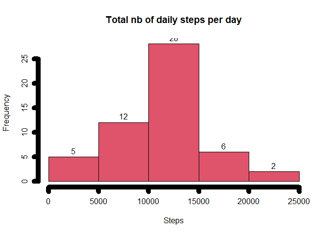
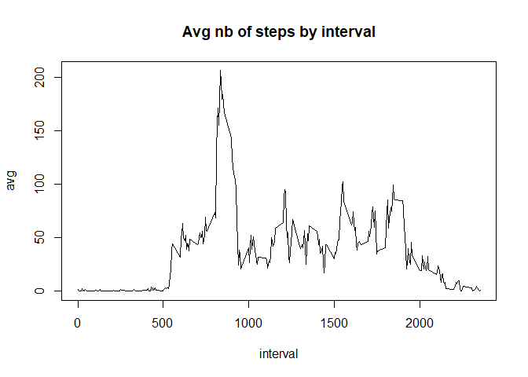
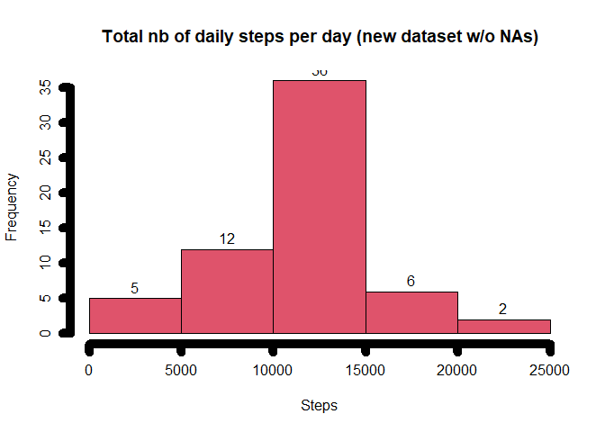
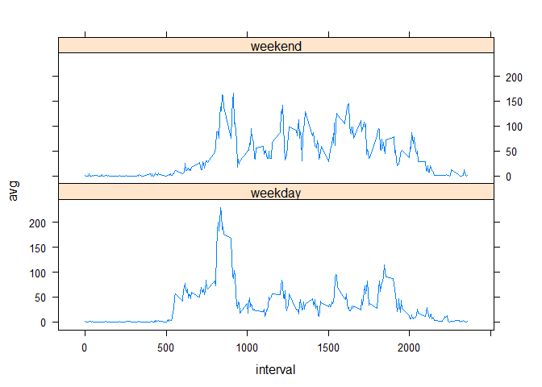

## Loading and preprocessing the data

```r
download.file(url="https://d396qusza40orc.cloudfront.net/repdata%2Fdata%2Factivity.zip", destfile="data.zip")
unzip("data.zip")
df = read.csv("activity.csv")
df$date = as.Date(df$date, "%Y-%m-%d")
str(df)
```

```
## 'data.frame':	17568 obs. of  3 variables:
##  $ steps   : int  NA NA NA NA NA NA NA NA NA NA ...
##  $ date    : Date, format: "2012-10-01" "2012-10-01" ...
##  $ interval: int  0 5 10 15 20 25 30 35 40 45 ...
```

## Histogram of the total number of steps taken each day

```r
library(dplyr)
```

```
## Warning: package 'dplyr' was built under R version 4.0.2
```

```r
d_steps = df %>% group_by(date) %>% summarize(daily_steps=sum(steps)) #this gives the total nb of steps per day
hist(d_steps$daily_steps, labels=TRUE, lwd=10, col=10,xlab="Steps", main="Total nb of daily steps per day")
```

<!-- -->

## What is mean and the median of the total number of steps taken per day?

```r
avg = as.integer(mean(d_steps$daily_steps, na.rm=TRUE))
med = median(d_steps$daily_steps, na.rm=TRUE)
```
The mean of the total nb of steps per day = 10766 and the median = 10765

## What is the average daily activity pattern?

```r
i_steps = df %>% group_by(interval) %>% summarize(avg=mean(steps, na.rm=TRUE))
with(i_steps, plot(interval, avg, type="l"))
title(main = "Avg nb of steps by interval")
```

<!-- -->

## Which 5-minute interval, on average across all the days in the dataset, contains the maximum number of steps?

```r
max = as.integer(i_steps[which.max(i_steps$avg),1])
```
The 5-min interval that contains (on avg) the maximum nb of steps is the one identified by 835

## Imputing missing values

```r
na_count = sum(is.na(df$steps))
#Let's assign the mean for that 5-minute interval to the missing values
intervals = unique(df[,"interval"])
for (i in intervals){
  i_avg = as.integer(subset(i_steps, interval==i)["avg"]) #get the avg nb of steps for this interval
  df$steps[is.na(df$steps) & df$interval==i] = i_avg
}
head(df)
```

```
##   steps       date interval
## 1     1 2012-10-01        0
## 2     0 2012-10-01        5
## 3     0 2012-10-01       10
## 4     0 2012-10-01       15
## 5     0 2012-10-01       20
## 6     2 2012-10-01       25
```

## Histogram of the total number of steps taken each day with the new datasets (without NAs)

```r
d_steps = df %>% group_by(date) %>% summarize(daily_steps=sum(steps)) #this gives the total nb of steps per day
hist(d_steps$daily_steps, labels=TRUE, lwd=10, col=10,xlab="Steps", main="Total nb of daily steps per day (new dataset w/o NAs)")
```

<!-- -->

If we compare the 2 histograms (the one before and the one after inputting missing values), the "shape" remains the same. The only difference is: the nb of days where the step count is btw 10.000 and 15.000 has increased by 8 (before 28, now 36) 

## Mean and median total number of steps taken per day with the new datasets (without NAs)

```r
avg = as.integer(mean(d_steps$daily_steps, na.rm=TRUE))
med = median(d_steps$daily_steps, na.rm=TRUE)
```
The mean of the total nb of steps per day = 10749 and the median = 10641. 
There is a minor difference with the mean and median we had before changing the NA values


## Are there differences in activity patterns between weekdays and weekends?

```r
# Let's create a new factor variable in the dataset with two levels – “weekday” and “weekend” indicating whether a given date is a weekday or weekend day.
df$week = ifelse(weekdays(df$date) %in% c("Saturday", "Sunday","samedi","dimanche"), "weekend", "weekday")
df$week = as.factor(df$week)
str(df)
```

```
## 'data.frame':	17568 obs. of  4 variables:
##  $ steps   : int  1 0 0 0 0 2 0 0 0 1 ...
##  $ date    : Date, format: "2012-10-01" "2012-10-01" ...
##  $ interval: int  0 5 10 15 20 25 30 35 40 45 ...
##  $ week    : Factor w/ 2 levels "weekday","weekend": 1 1 1 1 1 1 1 1 1 1 ...
```


```r
# Let's create a plot of the 5-minute interval (x-axis) and the average number of steps taken, averaged across all weekday days or weekend days (y-axis). 
library(lattice)
i_steps = df %>% group_by(interval,week) %>% summarize(avg=mean(steps, na.rm=TRUE))
xyplot(avg~interval | week, data=i_steps, layout=c(1,2), type="l")
```

<!-- -->
